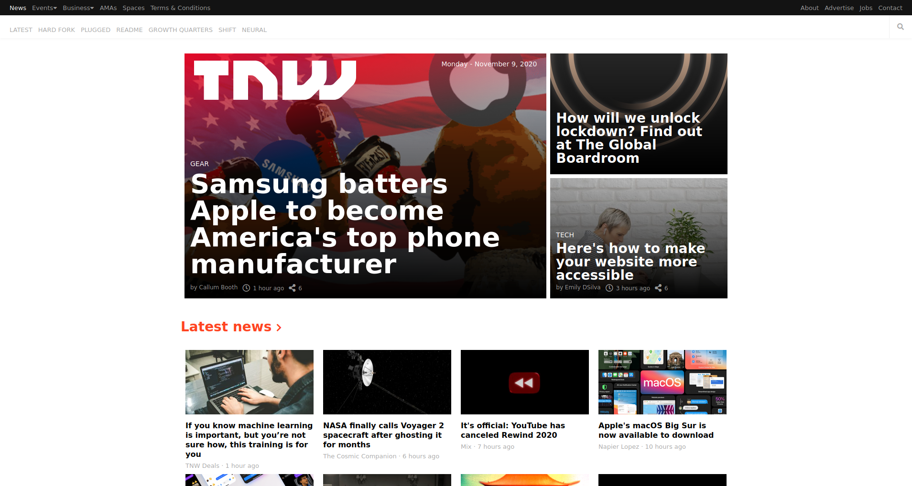

# The Next Web Clone

> In this project, I get the chance to build a responsive website. I cloned The Next Web (*as per [The Odin Project](https://www.theodinproject.com/courses/html-and-css/lessons/building-with-responsive-design)*), a tech-focused magazine which uses media queries to gracefully degrade their site as the window size is reduced. The process builds on the skills utilized in the previous projects done from [The Odin Project curriculum](https://www.theodinproject.com/home).



Additional description about the project and its features.

## Built With

- HTML5
- CSS3
  - Grid
  - Flexbox
  - Floats
  - Media Queries

## Live Demo

[Live Demo Link](https://antonyotero.github.io/responsive-design/)

## Getting Started

To get a local copy up and running follow these simple example steps.

### Prerequisites

- [Visual Studio Code](https://code.visualstudio.com/)
- [Live Server plugin](https://marketplace.visualstudio.com/items?itemName=ritwickdey.LiveServer) for Visual Studio Code 

### Setup

1- Clone the repository
```
git clone https://github.com/antonyotero/responsive-design.git
```
2- Open the cloned repo directory in VS Code, right click the index.html file and click on "Open With Live Server"

3- Everything should be running by now. 👍

## Author

👤 **Antony Otero**

- GitHub: [@AntonyOtero](https://github.com/AntonyOtero)
- Twitter: [@AntonyOtero](https://twitter.com/AntonyOtero)
- LinkedIn: [antonyotero](https://www.linkedin.com/in/antonyotero/)

## 🤝 Contributing

Contributions, issues, and feature requests are welcome!

Feel free to check the [issues page ](https://github.com/AntonyOtero/responsive-design/issues).

## Show your support

Give a ⭐️ if you like this project!

## Acknowledgments

- [@TheOdinProject](https://github.com/TheOdinProject)
- [@microverseinc](https://github.com/microverseinc)

## 📝 License

This project is [MIT](LICENSE) licensed.
